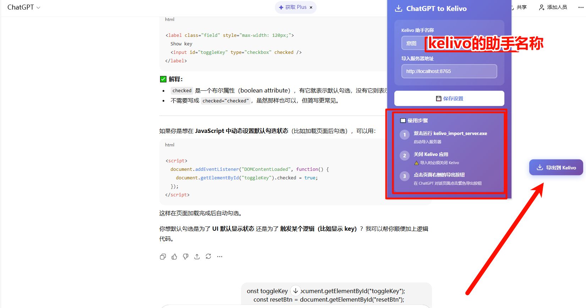

# ChatGPT to Kelivo 导出工具

将 ChatGPT 对话导出到 [Kelivo](https://github.com/Chevey339/kelivo) 本地聊天应用的浏览器扩展。

> ⚠️ **重要提示**：首次使用时，浏览器会弹出请求复制权限的提示。此时导出会失败，这是正常现象。请允许权限后，**重新点击导出按钮**即可成功导出。

## 前置要求

### 安装 Kelivo

在使用本扩展前，需要先安装 [Kelivo](https://github.com/Chevey339/kelivo) 本地聊天应用。

> 💡 **提示**：如果你之前使用过 Cherry Studio，可以将 Cherry Studio 的数据完全迁移到 Kelivo，所有信息都可以无缝导入。

## 安装步骤

### 1. 安装浏览器扩展

1. 打开 Chrome 浏览器，访问 `chrome://extensions/`
2. 打开右上角的"开发者模式"
3. 点击"加载已解压的扩展程序"
4. 选择 `browser-extension` 文件夹
5. 扩展安装完成
6. 点击扩展图标，在弹出窗口中输入 Kelivo 的助手名字，点击保存设置

### 2. 启动 Kelivo 导入服务器

双击运行 `kelivo_import_server.exe`

服务器会在后台运行，监听 `http://localhost:8765`

## 使用方法

1. **启动服务器**：运行 `kelivo_import_server.exe`
2. **打开 ChatGPT**：访问 https://chatgpt.com 并打开任意对话
3. **点击导出按钮**：页面右上角会出现"导出到 Kelivo"按钮
4. **等待导出完成**：扩展会自动提取对话内容并发送到 Kelivo
5. **查看导出结果**：导出的 Markdown 文件会保存在 Kelivo 的导入目录中

## 功能特点

- ✅ 自动提取完整对话内容
- ✅ 保留 Markdown 格式（粗体、代码块、列表等）
- ✅ 支持嵌套列表和复杂格式
- ✅ 一键导出到 Kelivo
- 

## 许可证

MIT License

## 支持

如有问题或建议，请联系开发者。

